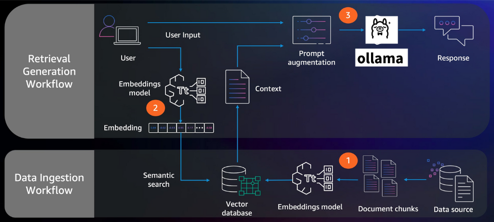
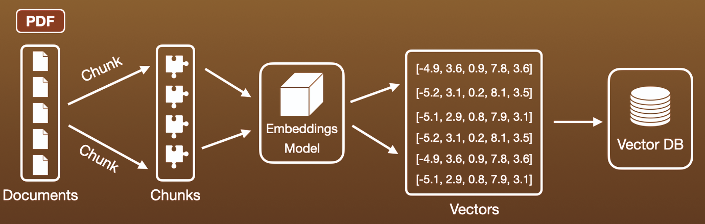

# 💬 PAN & Doc Chat AI(Local RAG System)

A privacy-focused, local AI application that allows users to chat with their PDF documents and perform high-speed validation for specific identifiers like **Indian PAN Card numbers**.

The system runs entirely on your local machine using **Ollama**, ensuring no data ever leaves your computer.

---

## 🚀 What it does

* **PDF Indexing:** Upload multiple PDF files and "index" them into a searchable mathematical database.
* **Contextual Chat:** Ask questions about the contents of your PDFs (e.g., "What is the summary of the contract?" or "What are the payment terms?").
* **Intelligent Routing:** Automatically detects if you are searching for a specific **PAN Number** and switches from "AI-thinking mode" to "Direct-search mode" for 100% accuracy.
* **Privacy First:** Uses local embeddings (`nomic-embed-text`) and local LLMs (via Ollama).
* **Clean UI:** A modern Streamlit interface with right-aligned user messages and left-aligned assistant responses.

---

## 🛠 How it works

The application follows a **RAG (Retrieval-Augmented Generation)** architecture combined with **Deterministic Logic** for specific patterns.

### 1. **Upload PDF**:
   After you upload a PDF file, the app will process the content using two modes:
   - **Simple Processing**: Extracts the text directly from the PDF (faster).

### 2. **LLM Provider Selection**: Once the PDF is processed,Select you llm provider
   - OLLAMA : Running Loccaly, You can select a model from a list of available Ollama models.

### 3. The Ingestion Pipeline

1. **PDF to Markdown:** Uses `pymupdf4llm` to convert PDF pages into Markdown text to preserve structure (tables, headers).
2. **Text Splitting:** The text is broken into 512-character chunks with a 100-character overlap using `RecursiveCharacterTextSplitter`. This ensures context isn't lost at the edges of a chunk.
3. **Vectorization:** Each chunk is passed through an **Embedding Model** (`nomic-embed-text`). This turns text into a vector (a list of numbers).
4. **Storage:** These vectors are stored in **ChromaDB**, a local vector database.

### 4. The Retrieval & Search Logic

When you type a message, the app performs a **Two-Tier Check**:

* **Tier 1: Regex Validation (Deterministic)**
* The app checks the input against a **Regular Expression** (`[A-Z]{5}[0-9]{4}[A-Z]`).
* If it matches a PAN format, it bypasses the AI and searches the database metadata directly for that exact string.


* **Tier 2: Vector Search (Semantic)**
* If it's a general question, the app converts your query into a vector.
* It finds the top 5 most similar chunks in the database.


### 5. The Generation (LLM)

1. The app creates a **Context Window** by combining your question with the retrieved chunks.
2. It sends this context to your selected **Ollama Model**.
3. The model generates a response based **only** on the provided PDF data.
4. **Post-Processing:** If the model includes "thought" tags (`<think>`), the app strips them out to show only the final answer.

---



---


---

## 📦 Technical Stack

| Component | Technology |
| --- | --- |
| **Frontend** | Streamlit |
| **Language** | Python |
| **PDF Processing** | PyMuPDF (pymupdf4llm) |
| **Vector DB** | ChromaDB |
| **LLM Orchestration** | LangChain / Ollama |
| **Embeddings** | nomic-embed-text |

---

## 🛠 Installation & Setup

1. **Install Ollama:** Download and install from [ollama.com](https://ollama.com).
2. **Pull Models:**
```bash
ollama pull nomic-embed-text
ollama pull qwen3:4b # or your preferred model
```
[Ollamma SLM Models](https://ollama.com/search)

[Ollamma Embed Models](https://ollama.com/search?c=embedding)

3. **Install Dependencies:**
```bash
pip install -r requirements.txt
```


4. **Run the App:**
```bash
streamlit run app.py
```
Then open your browser to `http://localhost:8501` (it will open automatically)

### NOTE: Suggested Python Version 3.10